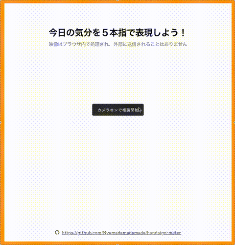

# 今日の気分を５本指で表現しよう！



## 環境構築

```terminal
git clone https://github.com/Nyamadamadamada/handsign-meter.git
cd handsign-meter
npm install
```

## デプロイの方法

1. `main`ブランチに最新のコードをマージ
2. `npm run build`を実行
3. push 後にタグをつける
4. GitHub Workflows が発火し、GitHubPages にデプロイされる

※ タグは`v0.0.1`など始めに`v`をつけること。

```bash
# タグの例
git tag -a v0.0.1 -m "画像を表示されるように" HEAD
git push origin --tags
```

### 初回だけやること

GitHub > Environments > Configure github-pages の

「Deployment branches and tags」を「No restriction」にする。

## 参照

ウェブ上で MediaPipe を用いて機械学習を行う際の 7 つの注意点
https://developers.googleblog.com/ja/7-dos-and-donts-of-using-ml-on-the-web-with-mediapipe/

手のランドマーク検出ガイド（ウェブ用）
https://ai.google.dev/edge/mediapipe/solutions/vision/hand_landmarker/web_js?utm_source=chatgpt.com&hl=ja

TensorFlow.js を使ったリアルタイムポーズ認識
https://ics.media/entry/240910/#top

DrawingUtils class
https://ai.google.dev/edge/api/mediapipe/js/tasks-vision.drawingutils

Python で画像認識　 MediaPipe を試す　-その 3-
https://eight-engineering-blog.com/
